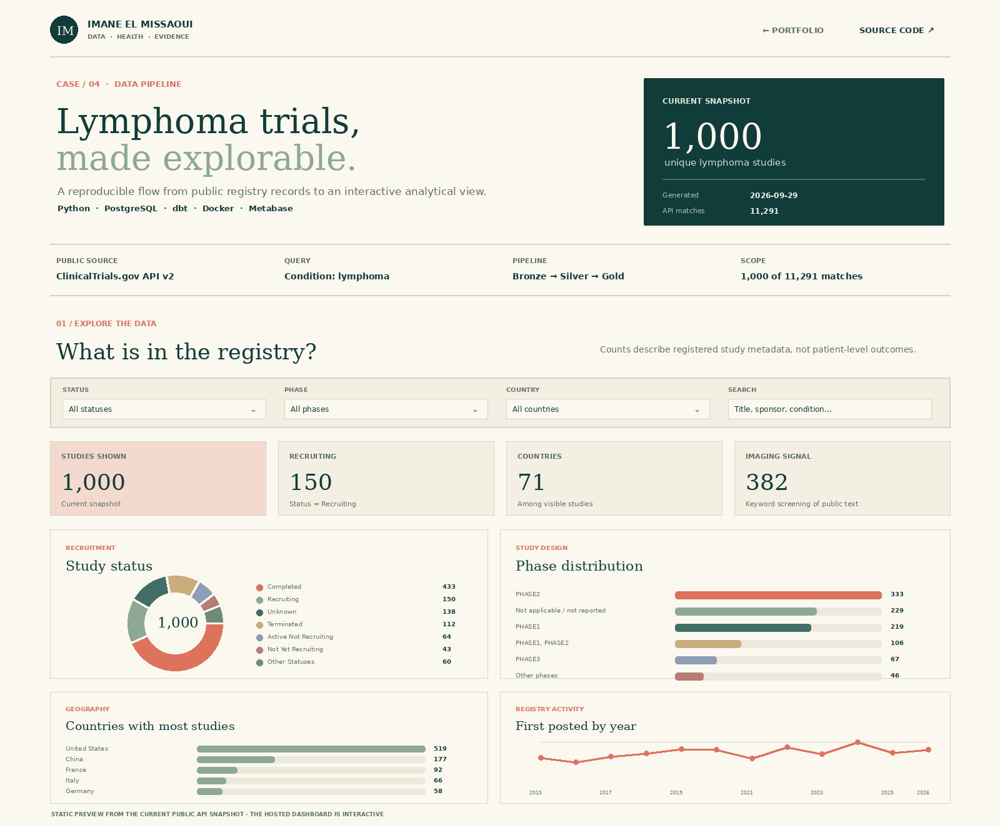
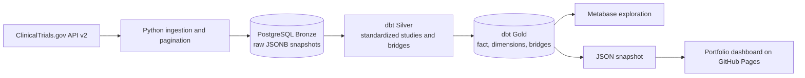
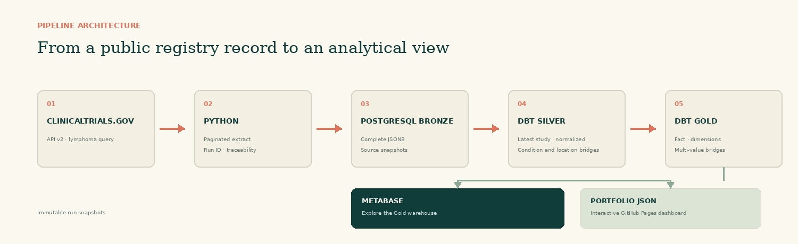
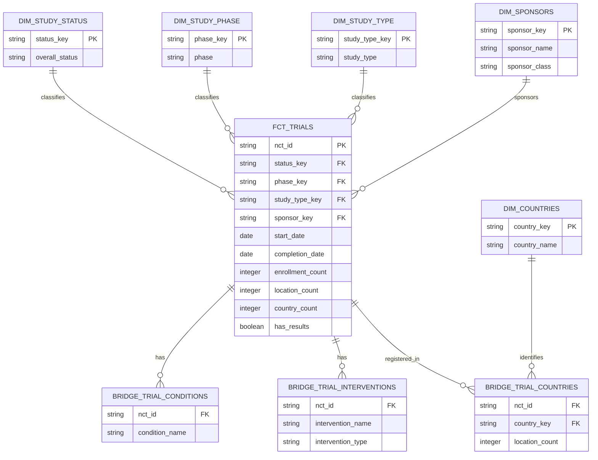

# Oncology Clinical Trials Intelligence Pipeline

An end-to-end data engineering project that turns public ClinicalTrials.gov records into a tested analytical warehouse and an interactive portfolio dashboard.

**Live dashboard:** [imaneelmissaoui.github.io/projects/clinical-trials-oncology-pipeline](https://imaneelmissaoui.github.io/projects/clinical-trials-oncology-pipeline/) · **Source:** [GitHub repository](https://github.com/imaneelmissaoui/clinical-trials-oncology-pipeline)

The default query searches the condition **lymphoma**. The pipeline follows API pagination and loads up to 1,000 studies by default. The dashboard snapshot is a bounded, dated extract; it is not a live query and should not be read as an exhaustive count of all lymphoma research.

## Dashboard preview



The hosted page works from a static JSON snapshot, so a visitor does not need access to the database or a Metabase account. Running the full pipeline can refresh the dashboard JSON from the Gold models.

## Architecture





The Bronze layer preserves the source study payload. Silver selects one record per NCT ID from the newest ingestion run, normalizes dates and expands multi-valued fields. Gold provides the study fact table, descriptive dimensions and many-to-many bridges for the fields that can repeat within one study.

## Gold warehouse schema



| Model | Grain | Purpose |
|---|---|---|
| `gold.fct_trials` | One row per NCT ID in the newest ingestion run | Study counts, enrollment, dates, result availability, imaging signal and location/condition/intervention measures |
| `gold.dim_study_status` | One row per reported status | Recruitment status filter and labels |
| `gold.dim_study_phase` | One row per phase value | Phase reporting; multi-phase source values stay grouped in the study's phase label |
| `gold.dim_study_type` | One row per study type | Interventional/observational comparisons |
| `gold.dim_sponsors` | One row per sponsor name and sponsor class | Sponsor ranking and classification |
| `gold.dim_countries` | One row per country name | Geographic labels |
| `gold.bridge_trial_conditions` | One row per study-condition pair | Conditions attached to a study |
| `gold.bridge_trial_interventions` | One row per study-intervention pair | Intervention names and types |
| `gold.bridge_trial_countries` | One row per study-country pair | Countries and registered site counts |

The fact grain is **one study**, not one location or intervention. Use bridge tables for multi-valued fields to avoid inflating study counts when grouping by a location, condition or intervention. Each new API run becomes the current snapshot; historical raw payloads remain available in Bronze.

## Data flow

### 1. Extract and load — Python

`src/clinical_trials_pipeline/api.py` calls the ClinicalTrials.gov API v2 studies endpoint with a condition query, page size and cursor token. `src/clinical_trials_pipeline/database.py` stores each complete record in `bronze.raw_studies` as JSONB, along with its NCT ID, extraction timestamp, source update date, query and run ID. `bronze.ingestion_runs` records the query, API total, page count and inserted/skipped counts for each run.

Each run appends a source snapshot. Duplicate NCT IDs within a run are ignored. The Bronze loader also adds the `api_query` column to an existing database created by the starter project.

### 2. Standardize — dbt Silver

- `int_latest_studies` selects the newest completed ingestion run, then picks one payload per NCT ID from that run. This keeps a changed query from silently mixing studies from earlier query snapshots into the latest dashboard export.
- `stg_studies` extracts study attributes, normalizes partial dates to the first day of the reported year or month, and calculates the reported study duration when both dates are usable.
- `stg_conditions`, `stg_interventions` and `stg_locations` produce one row per repeated value.
- `is_imaging_related` is a keyword screening signal from the source text. It is not a clinical classification or a measure of imaging use in practice.

### 3. Model and test — dbt Gold

`fct_trials` is the central one-row-per-study fact for the newest ingestion run. The Gold dimensions and bridge tables preserve the relationships needed for analytics. `dbt build` runs the models and tests together, including uniqueness and not-null checks, foreign-key relationships, and a custom non-negative-metrics test.

### 4. Explore — Metabase and the hosted dashboard

Metabase connects to the same PostgreSQL database for ad hoc SQL questions over `gold`. The portfolio page reads a compact JSON snapshot containing only public registry metadata and aggregates it into filters, KPIs and charts. Use `export-dashboard` after `run` to update that snapshot from the Gold models; the export is scoped to the latest completed ingestion run.

## Dashboard

The interactive page includes:

- filters for study status, phase, country and text search;
- counts for studies shown, recruiting studies, represented countries and records with an imaging-related keyword signal;
- charts for recruitment status, phase, country and first-posted year;
- a study explorer linking each NCT ID to its ClinicalTrials.gov record.

The dashboard is designed to distinguish a **study** from a **site**. A multi-country study counts once in the study total and once in each country where it has a registered location.

## Run locally

### Requirements

- Python 3.10 or newer
- Docker Desktop with Docker Compose
- Internet access to the public ClinicalTrials.gov API for ingestion

### Start PostgreSQL and Metabase

From the repository folder:

```bash
python -m venv .venv
```

Activate the environment (`source .venv/bin/activate` on macOS/Linux or `.venv\Scripts\Activate.ps1` in PowerShell), then install the project:

```bash
python -m pip install -e ".[dev]"
```

Optionally copy `.env.example` to `.env` and adjust the local settings. The defaults work for the local Compose setup.

```bash
docker compose up -d --wait postgres metabase
```

### Run the complete pipeline

```bash
python -m clinical_trials_pipeline run
```

This fetches up to 1,000 unique studies, writes a Bronze snapshot, builds the Silver and Gold models, and runs the dbt tests. Change the default query and cap with options:

```bash
python -m clinical_trials_pipeline run --condition lymphoma --limit 500 --page-size 250
```

Use `--limit 0` to follow all pages returned by the API query. A full query can take longer and store more source payloads. The default is intentionally bounded for a reproducible portfolio project.

### Refresh the portfolio JSON from Gold

When the portfolio repository is checked out next to this repository, run:

```bash
python -m clinical_trials_pipeline export-dashboard --output ../imaneelmissaoui.github.io/projects/clinical-trials-oncology-pipeline/data/dashboard.json
```

Then commit the updated JSON in the portfolio repository and push it to its published branch. If you cloned only this repository, choose any output path and copy the JSON to the dashboard's `data/dashboard.json` file.

For a quick front-end preview without PostgreSQL or dbt, create a public API snapshot directly:

```bash
python -m clinical_trials_pipeline preview --output ../imaneelmissaoui.github.io/projects/clinical-trials-oncology-pipeline/data/dashboard.json
```

The preview uses the same bounded API query but bypasses the warehouse; use the Gold export when you want a snapshot of the full pipeline output.

### Open Metabase

Go to [http://localhost:3000](http://localhost:3000) and complete the first-time setup. Add a PostgreSQL database with:

| Setting | Local value |
|---|---|
| Host | `postgres` |
| Port | `5432` |
| Database | Value of `POSTGRES_DB` (default `clinical_trials`) |
| Username | Value of `POSTGRES_USER` (default `clinical_user`) |
| Password | Value of `POSTGRES_PASSWORD` (default `change_me`) |

Select the `gold` schema to explore `fct_trials`, dimensions and bridge tables. Metabase stores its own setup in a separate persistent Docker volume.

Stop the services with `docker compose down`. The database and Metabase setup remain in their named volumes between restarts.

## Data quality and interpretation

- The ClinicalTrials.gov API is a public registry of study records. This project does not contain participant-level data.
- The default result set is capped at 1,000 records even when the API reports more matching studies. Check the snapshot timestamp and sample size before interpreting the charts.
- Source dates may be reported as a year, month or complete date. For analysis, a partial date is normalized to the first day of its reported period and remains an estimate.
- `has_results` indicates whether a record reports posted results; it does not assess the quality or outcome of those results.
- The imaging indicator searches public text for PET/PET-CT, MRI, CT, imaging/radiology and ultrasound terms. It is intended for exploration only.
- Country counts describe registered study locations, not participant recruitment totals.

## Repository layout

```text
clinical-trials-oncology-pipeline/
├── dbt/
│   ├── macros/                  # Schema naming and partial-date parsing
│   ├── models/silver/           # Latest study view and normalized staging models
│   ├── models/gold/             # Fact, dimensions and bridge tables
│   ├── profiles.yml             # Environment-based local PostgreSQL profile
│   └── tests/                   # Custom SQL data-quality assertion
├── docs/
│   ├── images/                  # README architecture/dashboard images
│   ├── data_dictionary.md
│   ├── project_scope.md
│   └── source_data_profile.md
├── sql/                         # PostgreSQL Bronze setup
├── src/clinical_trials_pipeline/ # API, database, transformations and CLI
├── tests/                       # Offline unit tests
├── compose.yaml                 # PostgreSQL and Metabase
└── pyproject.toml
```

## Reference and technical sources

- Public data source: [ClinicalTrials.gov API](https://clinicaltrials.gov/data-api/api)
- API background: [National Library of Medicine — ClinicalTrials.gov API v2](https://www.nlm.nih.gov/pubs/techbull/ma24/ma24_clinicaltrials_api.html)
- Architectural inspiration: [IhonaMaria / clinical-trials-pipeline](https://github.com/IhonaMaria/clinical-trials-pipeline)

The implementation here is scoped to this portfolio project: Python orchestrates API extraction and dbt, PostgreSQL stores the medallion layers, and the dashboard is served as a static portfolio page. Airflow and cloud hosting are outside the current scope.
